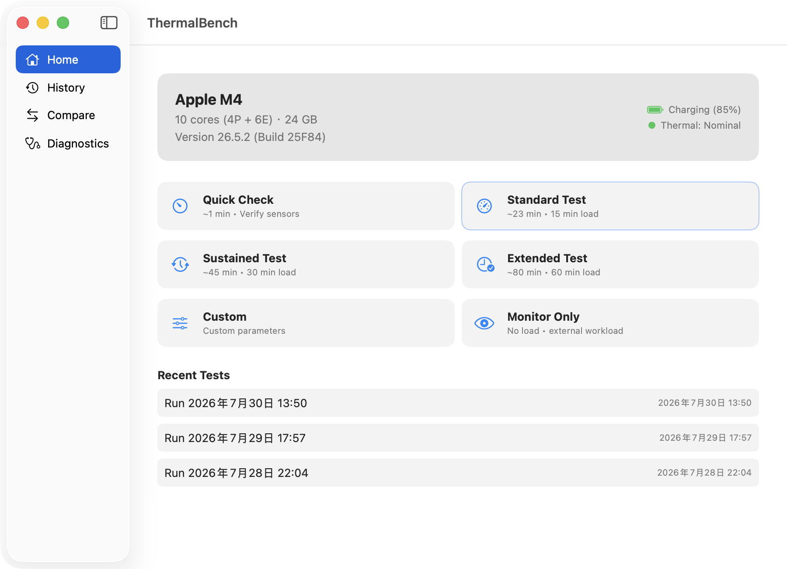
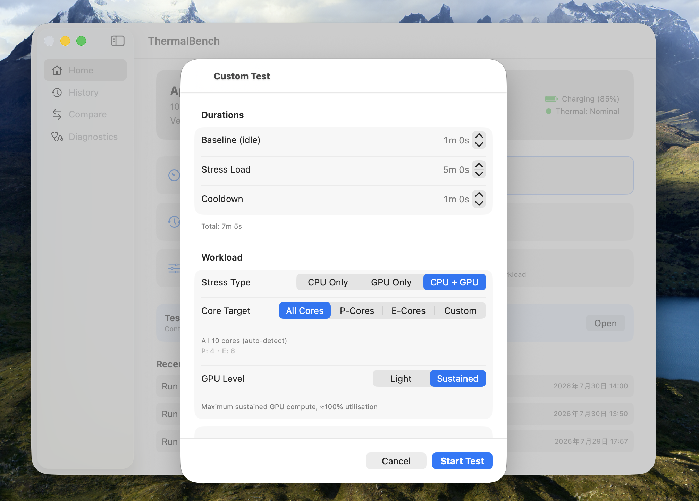
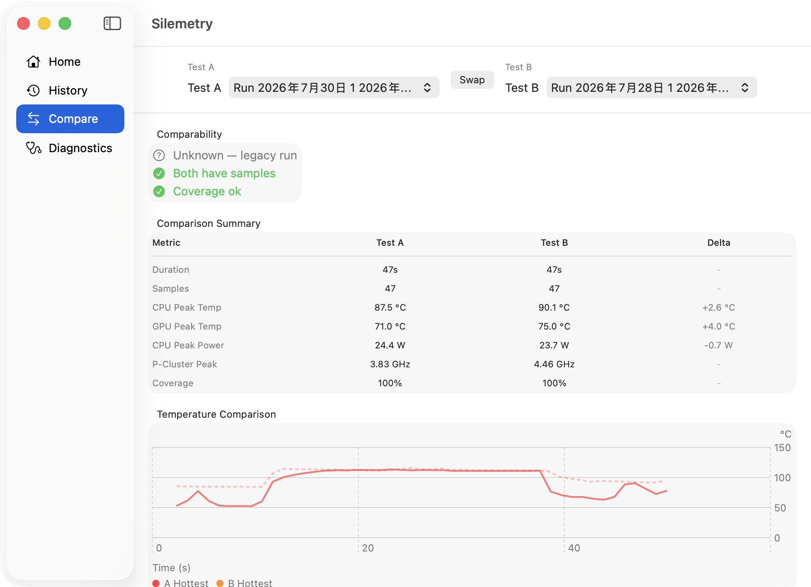

# Silemetry   

Silemetry is a native macOS telemetry tool for observing what an Apple Silicon Mac can sustain under continuous load.

Instead of capturing a single peak score, it records temperature, power, frequency, per-core activity, test-phase timing, and power status throughout the entire run. Completed tests are saved locally in History, where they can be reviewed, renamed, deleted, or compared side-by-side—useful for evaluating different cooling setups, macOS versions, or workload configurations.

  

---

#### Core Features

🔥 **CPU / GPU Stress Testing**

Three independent modes: CPU Only, GPU Only, and CPU + GPU. The GPU workload uses Metal compute with Moderate (~30%) and Maximum (~100%) presets. CPU Core Target lets you choose all cores, P-cores only, or E-cores only—the scheduling preference is implemented via macOS QoS, with no SIP modifications or kernel extensions required.

⚙️ **Custom Test**

Full control over stress type, core target, GPU level, phase durations (baseline / load / cooldown), sampling interval, and ambient temperature. Designed for controlled experiments.

📊 **Live Telemetry**

Real-time charts for CPU & GPU Hottest/Average temperatures, CPU/GPU/Package power, P-Cluster and E-Cluster frequency, per-core utilization, and macOS Thermal State (Nominal / Fair / Serious / Critical). All panels update as the test progresses.

👁️ **Monitor Only**

Records telemetry without starting any internal workload. Use alongside Cinebench, Blender, Xcode builds, local AI inference, video export, or any repeatable external workload.

📁 **History & Compare**

Every completed run is saved locally and can be renamed or deleted. The Compare view checks device, mode, and basic conditions for compatibility before overlaying metrics and timeline curves.

💻 **Dynamic Device Detection**

No hardcoded device assumptions. Silemetry reads model identifier, chip name, CPU P/E topology, memory, macOS version, and Metal device name at runtime via sysctl, ProcessInfo, and Metal. Each run stores a device snapshot—imported or compared runs preserve the identity of the original Mac.

🔋 **Power Awareness**

Distinguishes between AC charging, battery discharge, Low Power Mode, and unavailable states. Shown live on both the Home and active-test screens, with an extra indicator when Low Power Mode is active.

  

---

#### Test Modes & Collected Metrics

| | |
|---|---|
| 🔬 Quick Check | Verifies telemetry and workload startup—too short for steady-state analysis |
| 🔬 Standard | Routine thermal and performance comparison |
| 🔥 Sustained | Observes sustained power draw and frequency behaviour, closer to thermal equilibrium |
| 🔥 Extended | Long-duration deep analysis for evaluating cooling limits |
| ⚙️ Custom | Fully configurable: stress type, core target, phase durations, sampling, ambient temp |
| 👁️ Monitor Only | Records telemetry only, no internal load—pair with any external application |
| **Metrics** | |
| 🌡 CPU Hottest | Maximum among readable CPU thermal-zone sensors—not Apple's official junction temperature |
| 🌡 CPU Average | Arithmetic mean of the same sensor group |
| 🌡 GPU Hottest | Maximum among readable GPU thermal-zone sensors |
| 🌡 GPU Average | Arithmetic mean of the same sensor group |
| ⚡ CPU Power | CPU power draw. Shown as Unavailable when not readable—never replaced with zero |
| ⚡ GPU Power | GPU power draw |
| ⚡ Package Power | Package power and additional domains exposed by the platform |
| ⏱ P-Cluster Freq | P-core cluster frequency—a cluster-level metric, not per-core instantaneous clocks |
| ⏱ E-Cluster Freq | E-core cluster frequency |
| 🧩 Per-Core Util | Per-logical-core CPU utilization with separate P/E summaries |
| 🌡 Thermal State | macOS system thermal pressure: Nominal → Fair → Serious → Critical |
| ✅ Data Quality | Total samples, effective coverage duration, coverage ratio, and missing-sample statistics |

  

---

#### Download & Install

Download `Silemetry-v0.2.2-arm64.dmg` from [Releases](https://github.com/leecdiang/Silemetry-mac/releases/latest).

Open the DMG and drag Silemetry into Applications. The current preview is ad-hoc signed—on first launch, Control-click → **Open**, or approve it in **System Settings → Privacy & Security**. Do not disable Gatekeeper globally.

The release build requires no Homebrew, Python, sudo, kernel extensions, or SIP modifications.

---

#### Privacy

Silemetry runs entirely on-device: no account, no telemetry upload, no analytics or advertising SDKs, no cloud processing, no background daemon. All run data stays in the local Application Support directory and can be deleted from within the app.

---

#### Safety

Silemetry intentionally generates sustained CPU and GPU load. The enclosure becoming warm is normal, and macOS hardware thermal protection remains active at all times. Silemetry does not modify voltage, clocks, power limits, fan policy, or SMC parameters. Stop the test if the system behaves unexpectedly, and keep fan vents unobstructed on actively cooled Macs.

---

#### v0.2.1

Telemetry handle lifecycle and concurrency safety fixes, per-metric validity masks, Stop / Discard / failure finalization paths, JSONL archive integrity checks with streaming summaries, Compare comparability and corrupt-data checks, SwiftData rollback with file transactions, dynamic device and power-source change awareness with true startedAt, and 70/70 tests passing (CI #15).

Full changelog: [Release](https://github.com/leecdiang/Silemetry-mac/releases/latest).

---

#### Tech Stack

SwiftUI + Swift Charts · Embedded Rust Telemetry Core · C CPU Workload · Metal GPU Compute · SwiftData Persistence · sysctl + ProcessInfo + Metal Detection

The internal project name is `ThermalBench`; the public product is **Silemetry**. Building from source requires an Apple Silicon Mac with Xcode, a stable Rust toolchain, and Git.

---

#### Roadmap

- [x] CPU stress testing
- [x] Metal GPU stress testing
- [x] CPU + GPU combined workload
- [x] Monitor Only external recording
- [x] History persistence and Compare
- [x] Dynamic device detection
- [ ] Validation across more Apple Silicon models
- [ ] More complete report export
- [ ] Cross-device comparability analysis
- [ ] UI localization and compact-window refinement
- [ ] Developer ID signing and notarization
- [ ] Automated release pipeline

---

#### Application Icon

Uses `ai-chip-robot-flat` from the Streamline Flex Color icon collection (CC BY 4.0), converted and resized for the macOS AppIcon asset catalog with no visual modifications.

Source: https://icon-sets.iconify.design/streamline-flex-color/ai-chip-robot-flat/

---

#### License

Source code is released under the MIT License. Third-party components and icon licenses are detailed in `LICENSE` and `THIRD_PARTY_NOTICES.md`.

Built by [LEEcDiang](https://github.com/leecdiang).
